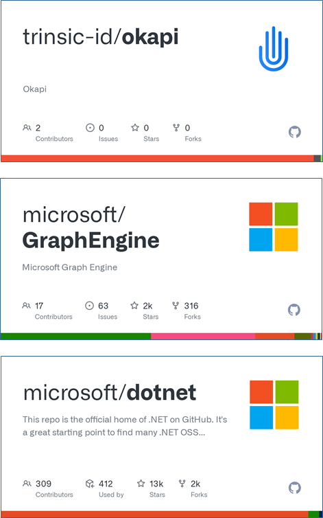
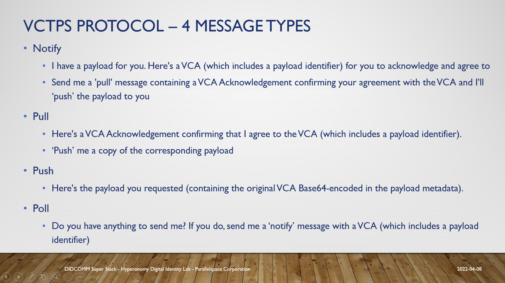
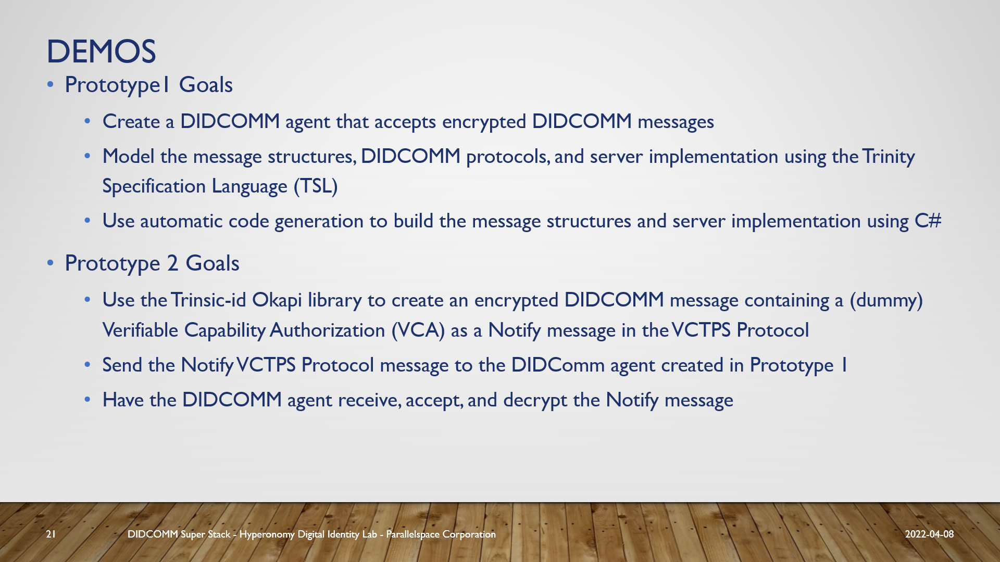
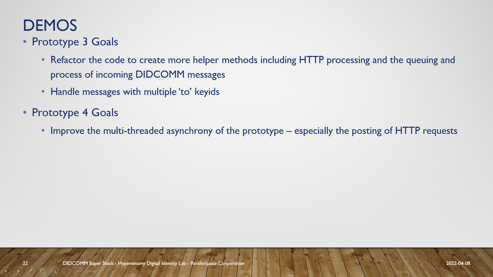
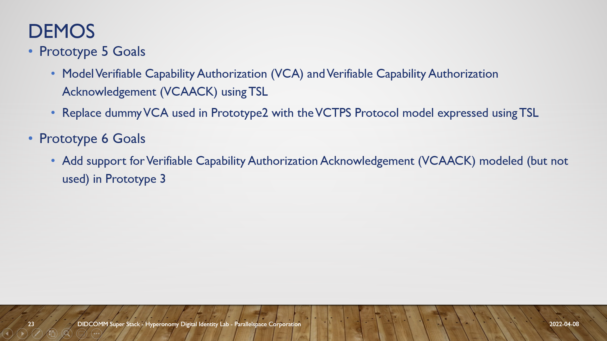

# VCTPSPrototypes
Creating highly scalable DIDCOMM Agents using .NET,  TRINITY,  and OKAPI with Ease

## DIDCOMM VCTPS Super Stack (VCTPSSS)

## VCTPS Message Types

## Demo Projects (VCTPS Protocol Prototypes)

