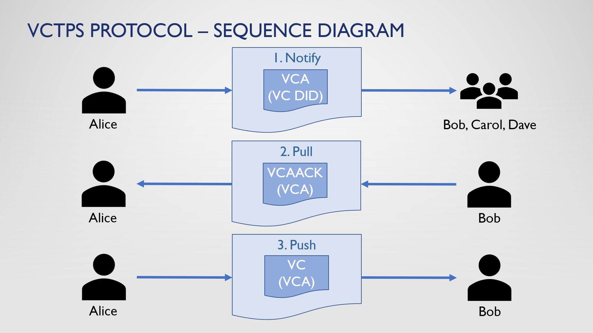

# DIDCOMM Super Stack (DIDSS)

Creating highly scalable DIDCOMM Agents using .NET,  TRINITY,  and OKAPI with Ease

## VCTPS Protocol

### Founding Principles

### VCTPS Protocol

### VCTPS Message Types

## Demo Projects (VCTPS Protocol Prototypes)

